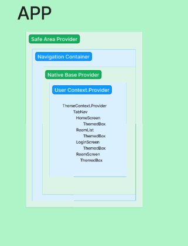

# Youth Connect - The app

    
    

     

## What is this project? 

- This repository contains the source code for a front end application using the [Youth Connect Backend](https://github.com/YouthConnect/youth-connect-backend) built on [React Native](https://reactnative.dev/) and [Expo](https://docs.expo.dev)

## What is Youth connect? 

- Youth connect is a mobile app built for Youth to join a safe and secure space. The app currently has support for download through the Google Play Store [Here!](https://google.com)

## The purpose of Youth Connect / Problem domain  

    To create a safe space for interaction between users, where they can
    share, collaborate, and seek help with homework or related topics.
    The app aims to provide a platform that ensures privacy, data security, and
    user-friendly features for effective communication.
    The greatest emphasis of the app is to keep everyone safe by providing
    secured groups only accessible by people who really know each other.

### Collaboration 

- Ryan Galloway
- Mark Smith
- Daniel Frey

### Features 

- Amazingly **Styled** UI
- **Consistent** Theme and Brand
- **Secure, Safe and Managed** space for
  - youth groups
  - teams
  - classes
  - and more
- **Signup/Login** with your own username
- **Join** a chat room
  - send messages in real time
  - send images and view them in the chat!
- **Create** a chat room
  - organize your space and chats
- Use your preferred light/dark **Theme**

## UML, Wireframe, and User Stories 

  

### How to run on your device 

- **install expo cli**
- `npm i`
- `npx expo start`
- `npx expo start --tunnel` (if npx expo start does not work for you locally)

### Please view information about the backend at [Youth Connect Backend](https://github.com/youthconnect/youth-connect-backend)

## Data privacy / How do we handle your data? 

- This app will not send or store any data that you do not provide it.
- The only information that is kept / saved is your log in info and the content of messages that you send
- Images you send will never be seen by anyone but yourself.
- Messages you send should not contain sensitive data about who you are or where you live (etc)
- All information will be wiped from the app soon after release

## How do I have my data removed from the app? 

To request that your data is removed from the app please send an email to youthconnectapp@gmail.com providing:

- your **in app** username.
- details about what data must be changed/removed
  upon request to have your data removed in part or entirety it will be processed shortly or we will ask for further clarification.

### Testing 

- `npm run tests`
